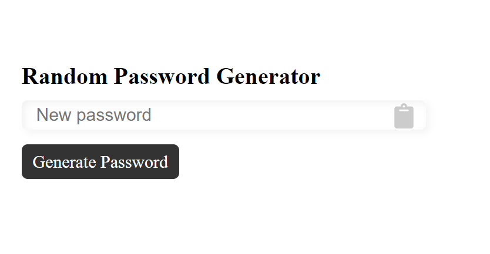
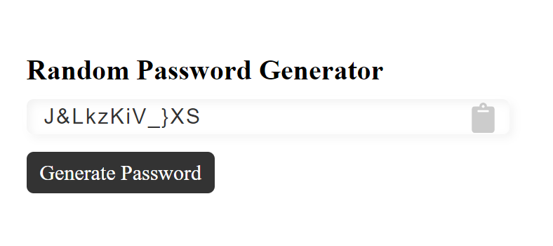

# Random Password Generator

This is a simple password generator. It is made using HTML, CSS and JavaScript.

## Screenshot



## Download
To run html in your localhost. You may clone the repo.
```bash
$ git clone https://github.com/varaprasadh/hack_the_fest.git
```

# Contribute
1. Fork the repo.
2. Add files in forked repo.
3. Commit to your forked repo.
4. Make a pull request to Master repo from your forked repo.
